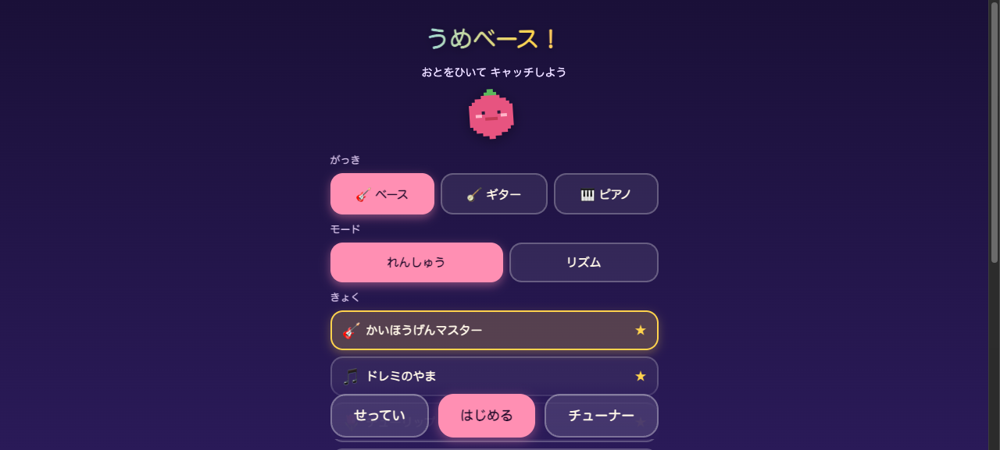
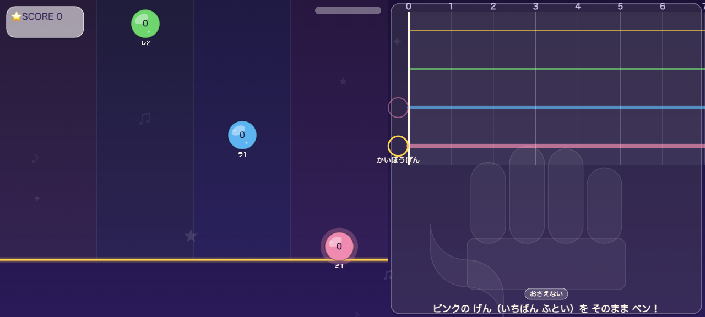
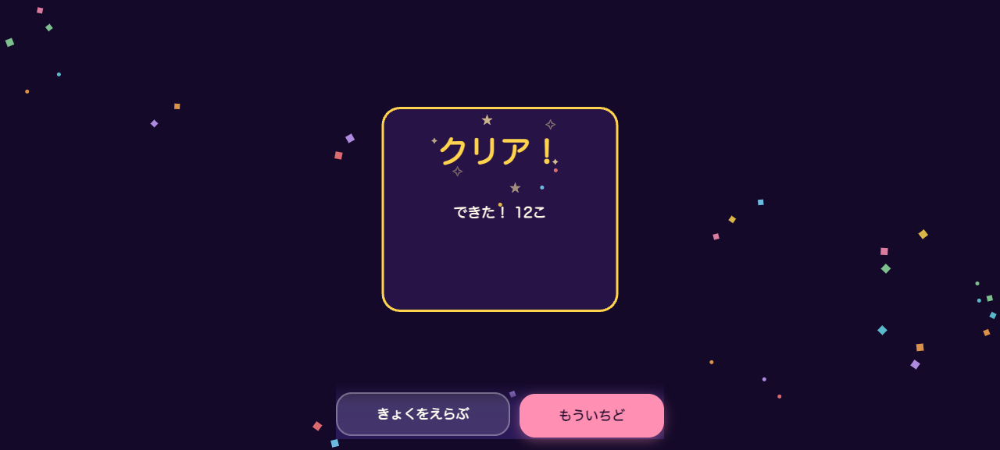

# rhythmkit — 落ち音符・楽器学習ゲーム基盤


> **English**: [README.en.md](README.en.md)

> ビートマニア式に音符が落ちてきて、**本物の楽器の音をマイクで拾って**正しい音程を弾くと当たる、子供向け楽器学習ゲームの基盤。
> iPhone Safari 動作・単一HTML・外部参照ゼロ・依存ゼロ。第1弾ゲームは「うめベース！」（ベース学習）。
> 契約の正本は [SPEC.md](SPEC.md)。
>
> *rhythmkit is a zero-dependency, single-file HTML rhythm-game kit for learning real instruments: falling notes are judged by **pitch-detecting your actual instrument through the microphone** (autocorrelation/NSDF, down to bass E1 = 41.2 Hz). Instruments, songs and games are plug-in data files — no engine changes needed. Japanese kid-friendly UI. MIT licensed.*

| タイトル | プレイ（運指ガイド付き） | リザルト |
|---|---|---|
|  |  |  |

## なにができるか

- **れんしゅうモード**: 音符が判定線で止まって、正しい音を弾くまで待ってくれる（ミスなし・何秒でもOK）。学習の主役
- **リズムモード**: 通常の音ゲー判定（PERFECT/GOOD/おしい！・コンボ・ランクS〜C）。**ゲームオーバーなし** — 必ず最後まで弾けてリザルトはいつもポジティブ（練習が主目的の設計）
- **チューナーモード**: 検出音名+セントメーター表示。楽器のチューニングに使える
- **運指ガイドパネル**（v1.3）: プレイ中つねに「どの弦の・何フレットを・どの指で」を表示。①フレットボード図（弦の太さ実物準拠・押さえ位置に脈動ドット+フレット番号）②**手の絵で使う指だけが光る**（ひとさしゆび〜こゆび・One-Finger-Per-Fret運指）③ことば指示「ピンクの げん・2フレットを なかゆびで！」。横長画面=右45%カラム / 縦長=下30%帯のレスポンシブ。ピアノは鍵盤図
- **検出音のリアルタイム表示**（v1.2）: 「いま: ラ」— 弾いた音が合ってれば緑・違えば橙で常時表示。間違えた時に「何を弾いてしまったか」が見える学習フィードバック
- **タイミング自動あわせ**（v1.2）: メトロノームに合わせて8回弾くだけでマイク遅延を自動計測・補正（設定画面から。手動スライダーも併存）
- ベストスコア🏆保存・設定の永続化（localStorage）・コンボ応援・リザルト紙吹雪
- 入力は3系統: **マイク実演奏**（ピッチ検出・ベースの最低音E1=41.2Hzまで対応）/ 画面タップ / キーボード（開発用）
- マイクが使えない環境では自動でタップ演奏にフォールバック
- **プライバシー**: マイク音声は端末内でピッチ解析されるだけで、録音・保存・送信は一切しない（本アプリは外部通信ゼロ。`grep "http" dist/` で検証可能）

## 部品構成

```
build.py            組立: python3 build.py <game_id> → dist/<game_id>/index.html（決定論・標準ライブラリのみ）
template.html       CSS/DOM骨格・viewport（iPhone縦持ち最優先）
engine/             汎用部品（楽器知識ゼロ）
  audio_synth.js      Web Audio手続き合成（プレビュー音/SFX/メトロノーム/iOS unlock）
  pitch_detector.js   マイク→ピッチ検出（NSDF自己相関+放物線補間。echoCancellation等はOFF固定）
  input_router.js     mic/touch/keyboard → 統一入力イベント
  highway.js          落下ノート描画（レーン数可変4/6/8・グラデ背景/グロー演出）
  fingerboard.js      押さえ位置ガイド（フレットボード図/鍵盤図・INSTRUMENT_DEF.displayで分岐）
  judge.js            判定（タイミング×音程・waitモード・スコア）
  hud.js              スコア/コンボ/マイクレベル/チューナー描画
  game_core.js        レジストリ+状態機械（title→micSetup→play→result / tuner）
instruments/        INSTRUMENT_DEF（1楽器=1ファイル）— bass / guitar / piano
charts/             CHART（曲データ）— 同梱10曲（かいほうげん/ドレミ/チューリップ/ぶんぶんぶん/ゆびのたいそう/きらきらぼし/メリーさんのひつじ/かえるのうた/ウォーキング/ロックリフ）
games/<id>/game.js  GAME_DEF（テーマ・収録曲・キャラ）
tests/              node実行の検証スイート（ピッチ検出精度/コンテンツ整合/判定ロジック）
```

3層契約: **楽器を足す=instruments/に1ファイル / 曲を足す=registerChart 1個 / 別ゲームを作る=games/に1ファイル**。エンジンは触らない。

## ビルドと実行

```bash
cd rhythmkit
python3 build.py umebass        # → dist/umebass/index.html（96KB・単一ファイル）
```

- 必要なのは Python 3 だけ（標準ライブラリのみ・追加パッケージ不要）。npm/node はテスト実行時のみ
- `umebass` は **game_id**（= `games/` 配下のディレクトリ名）。`games/mygame/game.js` を作れば `python3 build.py mygame` でビルドできる

- Macで開くだけならダブルクリックでOK（マイクはfile://では使えないのでタップ演奏になる）
- **iPhoneでマイクを使うには HTTPS 配信が必須**（getUserMediaの仕様）。pages.dev等に置く
- 検証: `node tests/test_pitch.js && node tests/test_content.js && node tests/test_smoke_judge.js`

## 新しい曲を足す（5分）

`charts/charts_basic.js` に1ブロック追記（または `charts/` 直下に新ファイル `charts_xxx.js` を作るだけでbuildが拾う）。
`registerChart` / `registerInstrument` は**エンジンが提供するグローバル関数**（import/require 不要。build.py が全ソースを1つのHTMLに結合する方式）:

```js
registerChart({
  id: 'mysong', title: 'あたらしいきょく', level: 2,
  bpm: 90, countInBeats: 4,
  notes: [            // beat=曲頭からの拍 / midi=実音高（楽器が勝手にレーンへ写像する）
    { beat: 0, midi: 36 },          // ド(C2)
    { beat: 1, midi: 43 },          // ソ(G2)
    { beat: 2, midi: 36, len: 2 },  // len=拍単位の表示長（省略時1）
  ],
  range: { min: 36, max: 43 },      // 使用音域（楽器のレンジ外なら選曲画面でグレーアウト）
});
```

`python3 build.py umebass` で完成。**ベース用に書いた曲はピアノ/ギターでもそのまま遊べる**（noteToLane写像が楽器側にあるため）。

## 新しい楽器を足す（10分）

`instruments/ukulele.js` を作る（例）:

```js
const INSTRUMENT_UKULELE = {
  id: 'ukulele', label: 'ウクレレ', emoji: '🎶',
  judgeModes: ['pitch', 'lane'],
  defaultJudgeMode: 'pitch',
  lanes: [   // 表示レーン（上から）。色はレーンのノート色
    { id:'A', label:'A(ラ)', openMidi:69, color:'#f6c945' },
    { id:'E', label:'E(ミ)', openMidi:64, color:'#6fd66f' },
    { id:'C', label:'C(ド)', openMidi:60, color:'#5db4f0' },
    { id:'G', label:'G(ソ)', openMidi:67, color:'#ef8bb0' },
  ],
  midiRange: { min: 60, max: 81 },
  mic: { fmin: 200, fmax: 1200, clarityMin: 0.83, levelMin: 0.01 },
  noteToLane(midi) { /* midi → {laneIndex, fret} を返す（instruments/bass.js の同関数を写経して調整） */ },
  pitchTolerance: 'pitchClass',   // オクターブ違い許容（'exact'で厳密）
  synthPatch: 'guitar',           // プレビュー音色（audio_synth.jsのキー。新音色はSYNTH_PATCHESに追加）
};
registerInstrument(INSTRUMENT_UKULELE);
```

あとは `games/umebass/game.js` の `instruments: ['bass','guitar','piano']` に `'ukulele'` を足して build。

## 別ゲームを作る

`games/<newid>/game.js` に GAME_DEF を1個書いて `python3 build.py <newid>`。テーマ色・収録曲・タイトル・応援セリフが差し替わる（catchkit の GAME_DEF 契約と同じ思想）。

## iPhone/音まわりの設計判断（変えると壊れるもの）

| 判断 | 理由 |
|---|---|
| getUserMedia の echoCancellation/noiseSuppression/autoGainControl 全OFF | iOSのAECが楽器音を「雑音」として潰すため。ONにすると低音が消える |
| AudioContext生成・getUserMedia はタップハンドラ内 | iOS Safariの自動再生制限 |
| fftSize=4096 + NSDF自己相関 + fmin=35Hz | ベースE1(41.2Hz)は周期24ms。4096サンプル@44.1kHzで約4周期確保 |
| pitchTolerance 既定 'pitchClass' | ベースは倍音が強くオクターブ誤検出が起きるため、子供向けにオクターブ違いを正解扱い |
| 判定窓 PERFECT±0.18s / GOOD±0.35s + offsetSec既定-0.12s | マイク+処理遅延（iOS実測50-150ms）を吸収。設定画面のスライダーで微調整可 |
| 時間軸は AudioContext.currentTime | rAFのタイムスタンプは音とズレる |

## テスト

```bash
node tests/test_pitch.js        # ピッチ検出精度（41.2/55/110/220Hz 合成波・誤差±1Hz以内）
node tests/test_content.js      # 3楽器×10曲717ノートの整合（beat昇順/音域/写像/fret≤7）
node tests/test_smoke_judge.js  # 判定ロジック17項目
node tests/test_waitclock.js    # れんしゅうモードのクロック停止/再開
node tests/test_boot_smoke.js   # ビルド生成物のDOMスタブ起動スモーク
```

## 検証状態（2026-07-11 v1.3）

- ピッチ検出精度: 41.2/55/110/220Hz 合成波で誤差ほぼ0Hz・clarity 1.0
- コンテンツ整合: 3楽器×10曲717ノートの写像全PASS（フレットボード表示域 fret≤7 保証）
- 判定ロジック17項目・waitクロック5項目・キャリブレーション13項目・運指写像11項目・起動スモーク7項目 全PASS
- 決定論ビルド: 2回連続sha256一致（単一HTML）
- 独立コード監査済み（多重startガード・NaN防御・二重rAF防止等の指摘を修正反映）
- **iPhone実機のマイク判定は実機テスト待ち**（合成波検証は済・実マイクの部屋鳴り/弦のミュート具合は実機でしか分からない）

## License

MIT
